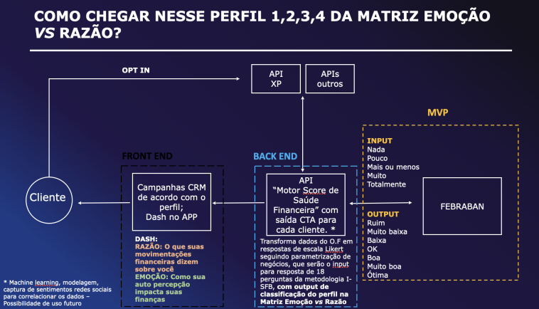
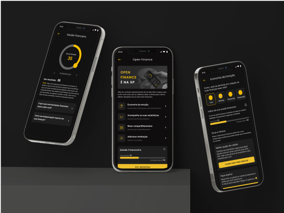
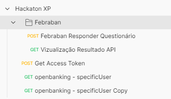


# API Financial Healthy - Hackaton XP

### Fluxograma API

## Swagger API Doc.
Utilize o link a seguir para acessar o Swagger e testar os endpoints da API em produção: http://51.222.32.180:5002/swagger/index.html

#### Como utilizar os endpoints Swagger
Primeiro utilize `/api/v1/Costumer/approve-open-finance` para aprovar o OpenFinance de um determinado usuário. O nome de usuário enviado no objeto
`
{
  "name": "PAULO",
  "allowTest": true,
  "allowOpenFinance": true
}
`
precisa estar cadastrado na API de OpenFinance da XP. O exemplo acima, com nome PAULO, é válido.

Após isso, você deve realizar uma consulta de saúde financeira para o usuário que você aprovou o OpenFinance utilizando o endpoint `/api/v{version}/Costumer/calculate-financial-healthy`.
Um payload válido seria:
`
"PAULO"
`

Depois disso, todos os demais endpoints estarão operáveis.

## FrontEnd da aplicação
Utilize o link a seguir para vizualizar o respositório do FrontEnd: https://github.com/rodolfomariano/Hackathon-XP-Front-end

## Acesso a API em Produção
Utilize este endpoint para acessar a API em produção: http://51.222.32.180:5002/api/v1/

## Ambiente de Testes Postman
Utilize os arquivos **.json** em `/PostmanDev/` para configurar o ambiente de desenvolvimento do PostMan

Estes são os endpoints das APIs que o projeto consume, utilize-os para testá-las e entender os dados retornados.